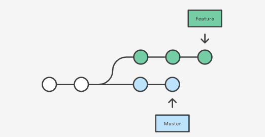
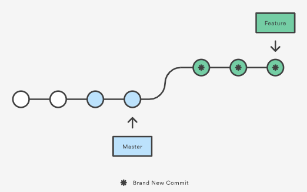
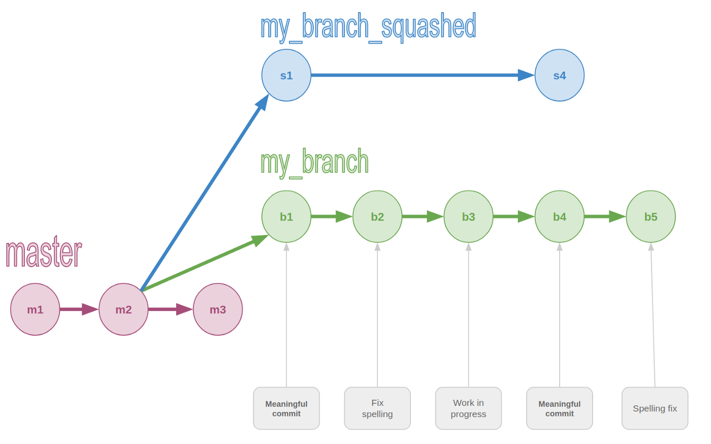

# Contributing

## Git Conventions

### 1. Single Purpose Commits

Only work related to each other should be in the same commit (e.g. don't fix two different bugs in the same commit).

### 2. Appropriate Size Commits

Split a feature's implementation into smaller logical chunks resulting in appropriate size commits. Don't commit a half-done work, nor commit a huge amount of work.

### 3. Meaningful Commit Messages

```txt
test: add unit tests for endpoint
^--^  ^-------------------------^
|     |
|     +-> Summary in present tense.
|
+-------> Type: docs, feature, fix, refactor, style, or test.
```

### 4. Don't Commit Generated Files

Files that can be re-generated (e.g. after compiling, installing, etc...) should be added to `.gitignore`.

### 5. Rebase Your Working Branch Frequently

As you continue to develop your branch, rebase it against `main` branch often.

- **Before Rebasing:**

    

- **After Rebasing:**

    

### 6. Squash Commits Before Merging

In general, there should only be one or a few commits added to master from each merged branch.



### 7. No Fast-Forward Merge

With Fast-Forward, it is impossible to see from the Git history, which of the commit objects together have implemented a feature. Reverting a whole feature, becomes more difficult, because it's a whole group of commits instead of just one.


