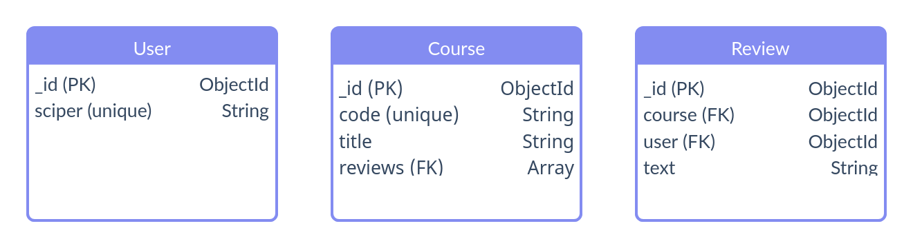

# Models
## Overview
Comprehensive overview of the created [Mongoose schemas](https://mongoosejs.com/docs/guide.html):

## Schemas

### User

Models a student user.

Properties:

| Name       | Type       | Description                                                                           |
|------------|------------|---------------------------------------------------------------------------------------|
| **_id**    | *ObjectId* | is the primary key, it is generated automatically whenever we create a new document   |
| **sciper** | *String*   | is a unique student id assigned by the university, saved in the form of a salted hash |

### Course

Models a university course.

Properties:

| Name        | Type       | Description                                                                         |
|-------------|------------|-------------------------------------------------------------------------------------|
| **_id**     | *ObjectId* | is the primary key, it is generated automatically whenever we create a new document |
| **code**    | *String*   | is a unique course code assigned by the university                                  |
| **reviews** | Array      | is an array of foreign keys, referring to the list of reviews left on this course   |

### Review

Models a student review of a course.

Properties:

| Name       | Type       | Description                                                                         |
|------------|------------|-------------------------------------------------------------------------------------|
| **_id**    | *ObjectId* | is the primary key, it is generated automatically whenever we create a new document |
| **course** | *ObjectId* | is a foreign key, referring to the reviewed course in question                      |
| **user**   | *ObjectId* | is a foreign key, referring to the author of the review                             |
| **text**   | *String*   | is the review text content                                                          |

