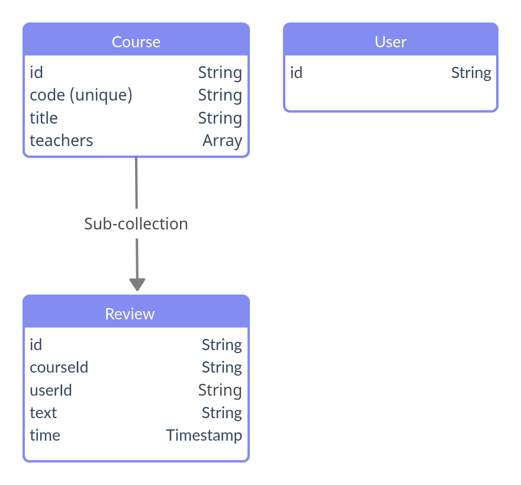

# Models
## Overview
Comprehensive overview of the followed schemas:

## Schemas

### User

Models a student user.

Properties:

| Name      | Type     | Description                                               |
|-----------|----------|-----------------------------------------------------------|
| **id**    | *String* | Generated automatically whenever we create a new document |

### Course

Models a university course.

Properties:

| Name         | Type       | Description                                                                       |
|--------------|------------|-----------------------------------------------------------------------------------|
| **id**       | *String*   | We use the course code as its id.                                                 |
| **code**     | *String*   | is a unique course code assigned by the university                                |
| **title**    | *String*   | is a string containing the title of the course                                    |
| **teachers** | [*String*] | is an array of strings containing the teachers of the course                      |

### Review

Models a student review of a course.

Properties:

| Name         | Type        | Description                                               |
|--------------|-------------|-----------------------------------------------------------|
| **id**       | *String*    | Generated automatically whenever we create a new document |
| **time**     | *Timestamp* | Timestamp of the review creation                          |
| **courseId** | *String*    | Course id of the course where the review was written      |
| **userId**   | *String*    | User id of the user who wrote the review                  |
| **text**     | *String*    | The text content of the review                            |

